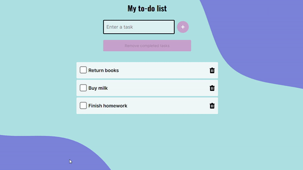

# To do list [School Project]

To do list is a classic task listing application. You can add and remove tasks. 

- It will neither send data to the server nor hold data locally.
- It's built in **React** and styled by **CSS modules**.
- This is my very first react application.

You can also check [Production Version](https://magical-brioche-a230d9.netlify.app/)
